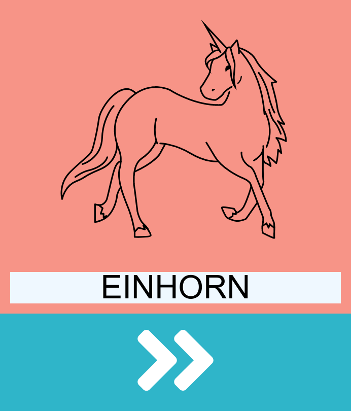

# Writing Game for Hannah

Just a little (german) writing game for my pre-school daughter :-)

It is an Angular PWA utilizing the SpeechSynthesis interface of the Web Speech API (because she can't read, yet).

Deployed via GitHub pages (yes, that's why I copied the whole dist folder to docs :-D).

This project was generated with [Angular CLI](https://github.com/angular/angular-cli).
